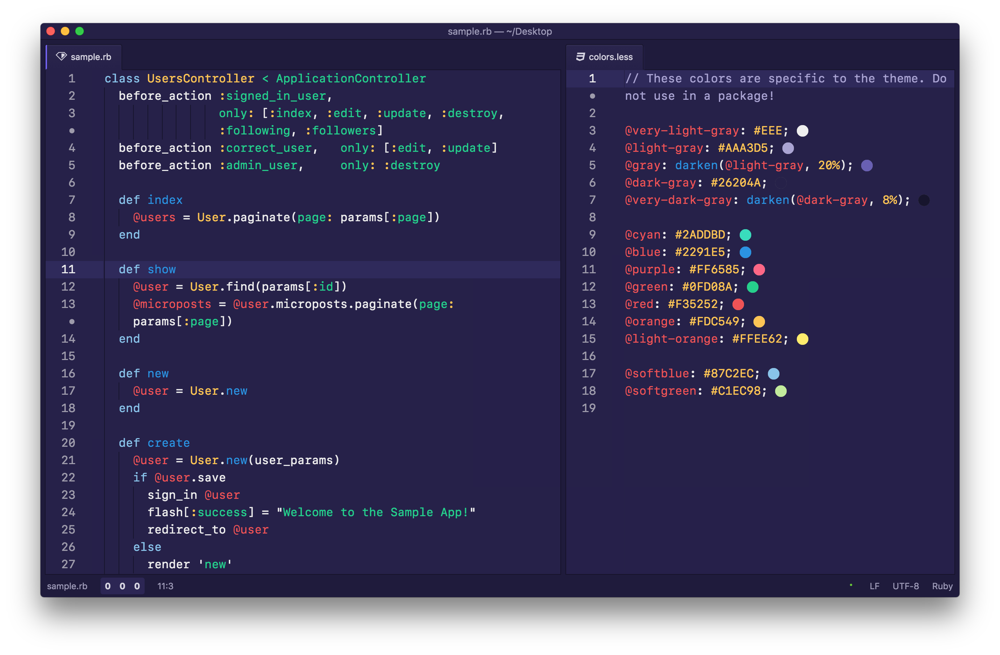

# deep-purple-syntax theme

A syntax theme inspired by the chester-atom-theme. I prefer it with slightly more higher contrast colors, but loved the basics of the chester theme! Hope you enjoy it!

# recommended setup with this theme
- "File icons" package, non-colored
- "Import SF mono" package, to use SF Mono as your font in Atom
- "One Dark" theme, which comes with Atom by default
- I recommend the spacious theme layout and the custom title bar, but it's a matter of preference of course!
- "Deep purple syntax" theme, this very syntax theme :)
